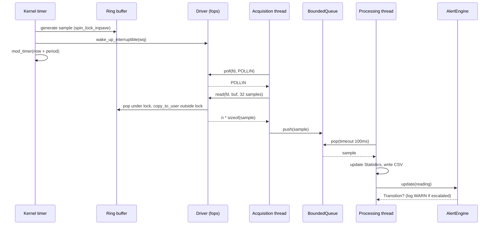
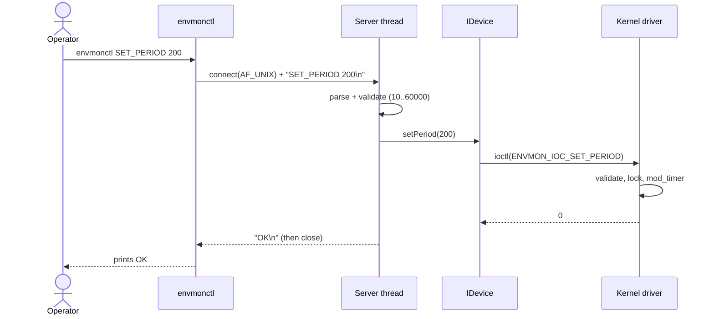
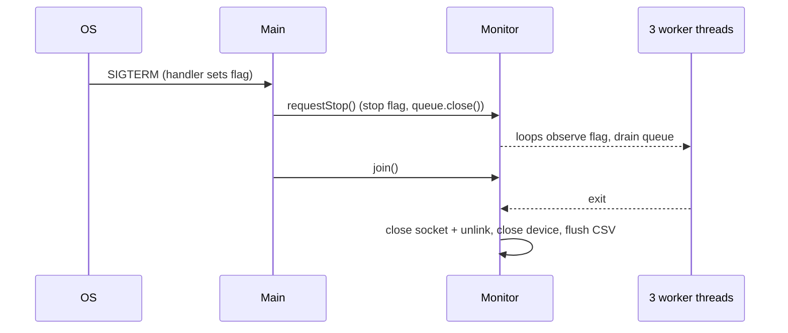

# Sequence Diagrams

## 1. Sample flow (timer → application → CSV/alerts)

```mermaid
sequenceDiagram
  participant Timer as Kernel timer
  participant Ring as Ring buffer
  participant Drv as Driver (fops)
  participant Acq as Acquisition thread
  participant Q as BoundedQueue
  participant Proc as Processing thread
  participant Alert as AlertEngine
  Timer->>Ring: generate sample (spin_lock_irqsave)
  Timer->>Drv: wake_up_interruptible(wq)
  Timer->>Timer: mod_timer(now + period)
  Acq->>Drv: poll(fd, POLLIN)
  Drv-->>Acq: POLLIN
  Acq->>Drv: read(fd, buf, 32 samples)
  Drv->>Ring: pop under lock, copy_to_user outside lock
  Drv-->>Acq: n * sizeof(sample)
  Acq->>Q: push(sample)
  Proc->>Q: pop(timeout 100ms)
  Q-->>Proc: sample
  Proc->>Proc: update Statistics, write CSV
  Proc->>Alert: update(reading)
  Alert-->>Proc: Transition? (log WARN if escalated)
```

## 2. Control command (`envmonctl SET_PERIOD 200`)

```mermaid
sequenceDiagram
  actor Op as Operator
  participant Ctl as envmonctl
  participant Srv as Server thread
  participant Dev as IDevice
  participant Drv as Kernel driver
  Op->>Ctl: envmonctl SET_PERIOD 200
  Ctl->>Srv: connect(AF_UNIX) + "SET_PERIOD 200\n"
  Srv->>Srv: parse + validate (10..60000)
  Srv->>Dev: setPeriod(200)
  Dev->>Drv: ioctl(ENVMON_IOC_SET_PERIOD)
  Drv->>Drv: validate, lock, mod_timer
  Drv-->>Dev: 0
  Srv-->>Ctl: "OK\n" (then close)
  Ctl-->>Op: prints OK
```

## 3. Graceful shutdown

```mermaid
sequenceDiagram
  participant OS
  participant Main
  participant Mon as Monitor
  participant Th as 3 worker threads
  OS->>Main: SIGTERM (handler sets flag)
  Main->>Mon: requestStop() (stop flag, queue.close())
  Mon-->>Th: loops observe flag, drain queue
  Main->>Mon: join()
  Th-->>Mon: exit
  Mon->>Mon: close socket + unlink, close device, flush CSV
```
